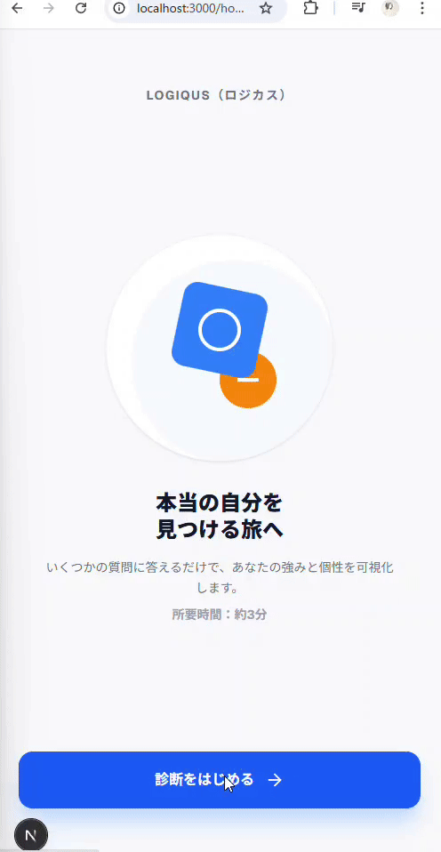
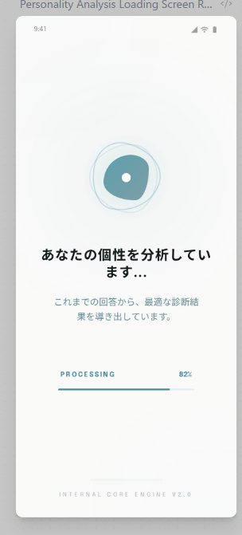

# 学習スタイル診断アプリ

## アプリ概要

ユーザーの学習傾向を8つの質問から分析し、4つの基本タイプ＋Mix型＋特殊型の全10パターンから最適な学習スタイルを提案するアプリ。

## 技術スタック

- React
- Next.js (ReactのフレームワークであるNext.jsを使う)
- 使用したAIツール・武器
  - Gemini: ロジック構築、デバッグ、コードの書き出し（思考パートナー）
  - Manus / Google Stitch: UI/UXデザインのビジュアル化
  - GitHub Copilot: コーディング中の補完、テスト作成のサポート

## 要件定義

### 診断：質問リスト

| 問  | 質問                                           | キーワード           |
| --- | ---------------------------------------------- | -------------------- |
| Q1  | なぜそうなるのか、理屈を納得してから進みたい？ | 理論重視型（理解力） |
| Q2  | 説明書より、まずは実際に触って体感したい？     | 実践重視型（行動力） |
| Q3  | 毎日決まったルーティンで進めるのが好き？       | コツコツ型（継続力） |
| Q4  | スイッチが入った時の没頭力には自信がある？     | 短期集中型（没頭力） |
| Q5  | 知識を体系立てて整理して覚えるのが得意？       | 理論重視型（理解力） |
| Q6  | 何かを作りながら学ぶ方が記憶に残る？           | 実践重視型（行動力） |
| Q7  | 大きな目標を一歩ずつ着実に進めるのが好き？     | コツコツ型（継続力） |
| Q8  | 短時間で一気に深い集中状態になりたい？         | 短期集中型（没頭力） |

### 結果

理論重視型 / 実践重視型 / コツコツ型 / 短期集中型

| タイプ             | キーワード   | 説明                                                       |
| ------------------ | ------------ | ---------------------------------------------------------- |
| 理論重視型         | 理解力       | まずは説明書や理論を読んでから始めたい                     |
| 実践重視型         | 行動力       | やりながら覚えるのが一番効率がいいと思う                   |
| コツコツ型         | 継続力       | 毎日決まった時間に少しずつ進めるのが好き                   |
| 短期集中型         | 没頭力       | 一度スイッチが入ると、短時間で一気に深い集中状態になれる   |
| 万能ハイブリット型 | 全能         | あらゆる方法を使いこなせる最強の学習者。自由自在な使い分け |
| これから発見型     | 未知の可能性 | ぴったりのスタイルを探索中。宝探しのように試す時期         |

### 回答文

| タイプ             | キーワード       | 解説メッセージ（回答文）                                                                                                                                                           |
| ------------------ | ---------------- | ---------------------------------------------------------------------------------------------------------------------------------------------------------------------------------- |
| 理論重視型         | 理解力           | 「なぜ？」を解決することがやる気の源泉です。全体像を把握し、納得してから進むことで驚異的な理解力を発揮します。論理的なつながりが見えた時、あなたの学習スピードは最大化されます。   |
| 実践重視型         | 行動力           | 考えてから動くより、動いてから考える方が得意なタイプ。まずは手を動かし、小さな失敗を積み重ねるのが一番の近道です。理論は後からついてくる、というスタンスがあなたには合っています。 |
| コツコツ型         | 継続力           | 継続こそが最大の武器。派手な一歩よりも、昨日の自分を超える数ミリの積み重ねが自信に繋がります。最終的に誰よりも高い場所に到達できる、圧倒的な安定感の持ち主です。                   |
| 短期集中型         | 没頭力           | 集中した時の密度はピカイチ。スイッチが入った時に一気に進め、無理に分散させず「今はこれ！」と決めて没頭するのが吉です。短時間で本質を掴み取る、瞬発力のある学習スタイルです。       |
| 万能ハイブリット型 | すべて「はい」   | おめでとうございます！あらゆる学習方法を高い次元で使いこなせる最強の学習者です。状況に合わせてスタイルを自由自在に使い分けられます。                                               |
| これから発見型     | すべて「いいえ」 | まだ自分にぴったりのスタイルを探している最中かもしれません。まずは「これなら楽しそう」と思えるものから、宝探しのように試してみましょう！                                           |

### Mix型の場合

| 型                  | キーワード                                 |
| ------------------- | ------------------------------------------ |
| 理論 × 実践         | 納得感と行動力をどちらも備えたバランス派！ |
| 理論 × コツコツ     | 納得感と継続力をどちらも備えたバランス派！ |
| 実践 × 短期集中     | 行動力と没頭力をどちらも備えたバランス派   |
| コツコツ × 短期集中 | 継続力と没頭力をどちらも備えたバランス派！ |

## 設計

### ロジック

- 基本判定: 各タイプの回答（はい）を集計し、最大スコアのタイプを算出。
- Mix判定: 同率1位が2つある場合、特定の組み合わせ（理論×実践など）を表示。
- 優先順位: 同率時の優先度は「理論 ＞ 実践 ＞ コツコツ ＞ 短期集中」。
- 特殊判定:
  - 万能ハイブリット型: すべて「はい」の場合。
  - これから発見型: すべて「いいえ」の場合。

## デザイン

ローディング画面

## コーディング・テスト・ CI/CD（自動チェック）

1. Lintによる静的解析 (ESLint)
2. GitHub Actions による CI (自動チェック)

